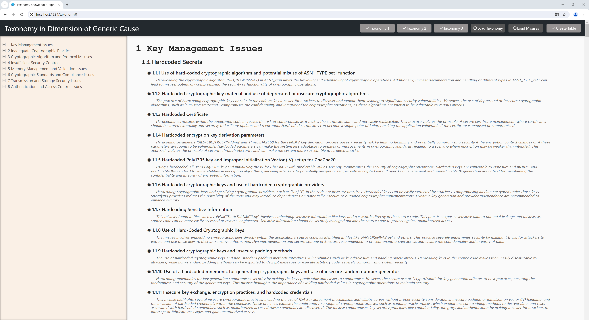

# Taxonomy Results

For a more interactive and accessible presentation of the taxonomy results, we've developed an HTML-based web interface. This allows users to explore the results in a more dynamic and user-friendly manner. To ensure ease of use and consistency across different environments, we've containerized our application using Docker.


## Getting Started

To run the web interface, follow these steps:

1. Unzip jscode_image.zip:
   ```
   unzip jscode_image.zip
   ```

2. Load the Docker image:
   ```
   docker load -i .\jscode_image.tar
   ```

3. Run the Docker container:
   ```
   docker run -it -p 1234:1234 --name=jscode jscode_image
   ```

4. Access the web interface:
   Open your web browser and navigate to `http://[Your-IP-Address]:1234`

## Preview


