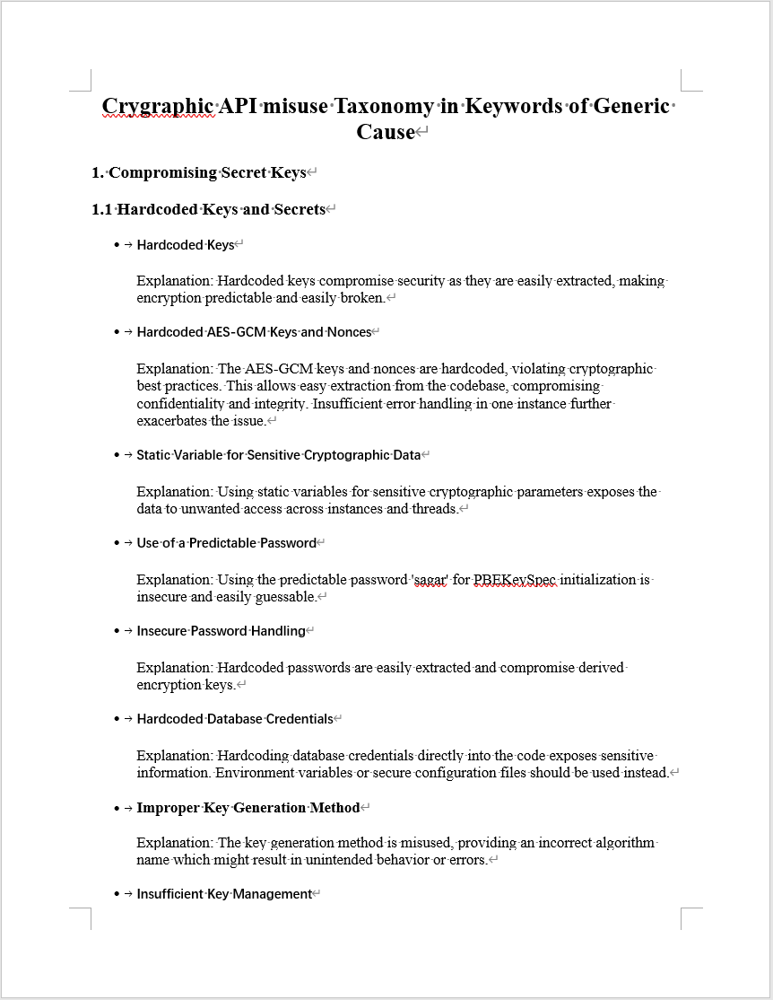

# Taxonomy Results

We display taxonomy examples derived from candidate LLMs on datasets Dsub and Dl. 
For a more interactive and accessible presentation of the taxonomy results, we've developed an HTML-based web interface. This allows users to explore the results in a more dynamic and user-friendly manner. To ensure ease of use and consistency across different environments, we've containerized our application using Docker.


## Getting Started

To run the web interface, follow these steps:

1. Build the Docker image:
   ```
   docker build -t js_web .
   ```

2. Run the Docker container:
   ```
   docker run -p 8000:8000 js_web
   ```

4. Access the web:
   Open your web browser and navigate to `http://localhost:8000`

## Preview
Select and upload the taxonomy result file provided by CryMisTa in txt format.


Select and upload the corresponding Misuse list for this taxonomy result file.


Click the "Display" button.


The "Download" button provides the functionality to convert the displayed results into a Word format file.

